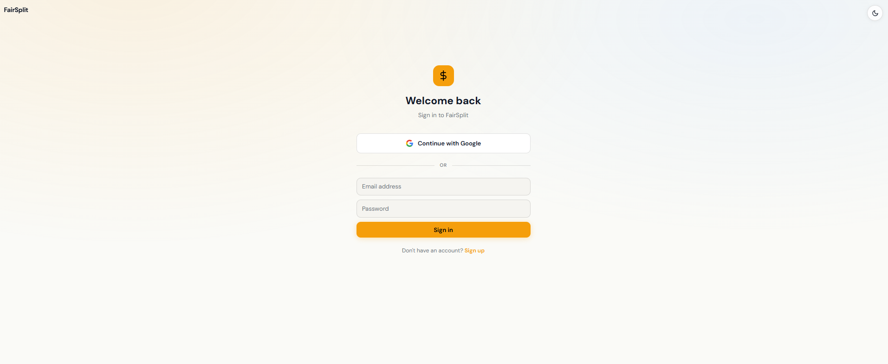
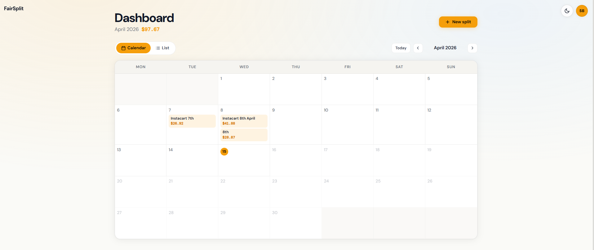
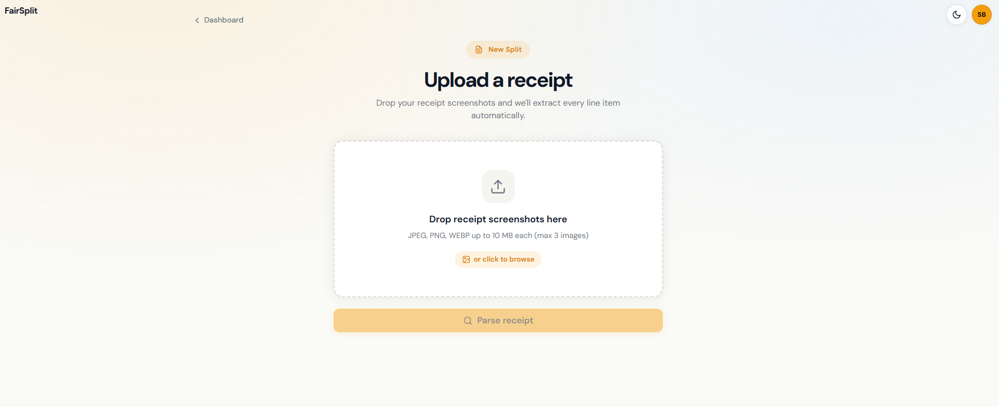
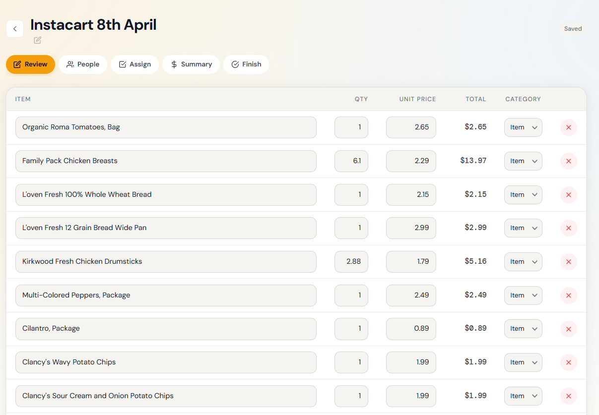
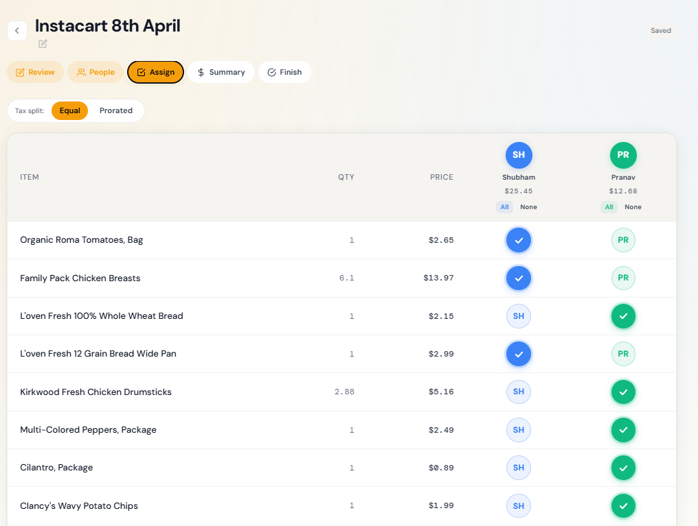
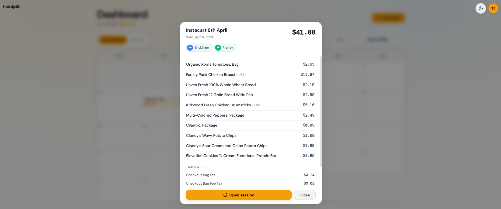
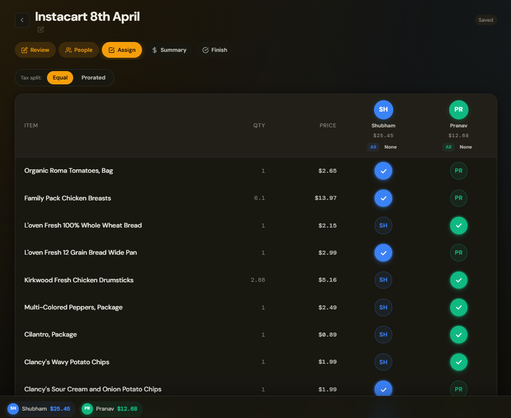

# FairSplit

FairSplit helps you split grocery and delivery receipts fairly: upload receipt screenshots, let AI extract line items, assign them to people, and settle totals with prorated taxes and fees.

## The problem

Shared orders from apps like Instacart or other delivery services produce long, messy receipts: replacements, weight adjustments, bag fees, service fees, tips, and discounts. Manually typing that into a spreadsheet or doing mental math is slow and error-prone, and splitting “the total” evenly ignores who actually ordered which items.

## What this app does

1. **Parse** — You upload one or more receipt images. The backend uses **Google Gemini** (default) or **Anthropic Claude** to extract structured line items (products, discounts, taxes, fees, tips).
2. **Organize** — Review and fix line items, add people, then assign each line (or split shared items across multiple people).
3. **Settle** — Totals include each person’s share of items plus their share of taxes and fees, either **prorated by subtotal** or split evenly, depending on your session settings.
4. **Remember** — Sign in with **Supabase Auth** (email or Google). Sessions are stored in **Supabase Postgres** (with an in-memory fallback when Supabase is not configured for local experiments).

## Screenshots

<div align="center" style="display:flex; gap:12px; overflow-x:auto; padding:8px 0;">
  
  
  
  
  
  
  
</div>

## Tech stack

| Layer | Choice |
| --- | --- |
| API | Python 3.10+, FastAPI |
| Web | Next.js 16, React 19, Tailwind CSS v4, Framer Motion |
| Auth & DB | Supabase (Auth + Postgres) |
| AI | Gemini or Claude |

## Prerequisites

- **Python 3.10+**
- **Node.js 18+** (20+ recommended for Docker)
- A **[Supabase](https://supabase.com)** project (free tier is enough)
- An API key for your chosen AI provider (**Gemini** and/or **Anthropic**)

## Clone the repository

```bash
git clone https://github.com/YOUR_USERNAME/YOUR_REPO.git
cd YOUR_REPO
```

## Environment variables and secrets

**Do not commit real keys.** The repo ignores `.env` and common local env files via [`.gitignore`](.gitignore).

- **Backend:** copy [`backend/.env.example`](backend/.env.example) to `backend/.env` and fill in values.
- **Frontend:** copy [`frontend/.env.local.example`](frontend/.env.local.example) to `frontend/.env.local`.

Only variables that the apps read are listed in those example files.

## Setup

### 1. Supabase

1. Create a project at [supabase.com](https://supabase.com).
2. Open **SQL Editor** and run [`backend/supabase_schema.sql`](backend/supabase_schema.sql).
3. Under **Authentication → Providers**, enable **Email** (default) and optionally **Google** (requires OAuth client ID/secret from Google Cloud Console).
4. Under **Settings → API**, copy:
   - **Project URL** → `SUPABASE_URL` (backend) and `NEXT_PUBLIC_SUPABASE_URL` (frontend)
   - **anon public** → `NEXT_PUBLIC_SUPABASE_ANON_KEY` (frontend)
   - **service_role** → `SUPABASE_SERVICE_ROLE_KEY` (backend only; keep server-side)
   - **JWT Secret** (under JWT Settings) → `SUPABASE_JWT_SECRET` (backend)

### 2. Backend

```bash
cd backend
python -m venv .venv
# Windows: .venv\Scripts\activate
# macOS/Linux: source .venv/bin/activate
pip install -r requirements.txt
cp .env.example .env   # Windows: copy .env.example .env
# Edit .env with your keys, then:
uvicorn main:app --reload --port 8000
```

### 3. Frontend

```bash
cd frontend
npm install
cp .env.local.example .env.local   # Windows: copy .env.local.example .env.local
# Edit .env.local, then:
npm run dev
```

Open [http://localhost:3000](http://localhost:3000). The UI expects the API at `NEXT_PUBLIC_API_URL` (default `http://localhost:8000`).

### 4. Docker (optional)

From the repo root, with `backend/.env` and `frontend/.env.local` present:

```bash
docker compose up --build
```

This starts Redis, the API on port **8000**, and the Next dev server on **3000** (see [`docker-compose.yml`](docker-compose.yml)).

### 5. Existing `split_sessions` table (auth migration)

If you already had a `split_sessions` table before per-user auth, run in the Supabase SQL Editor:

```sql
alter table public.split_sessions add column if not exists user_id text;
create index if not exists idx_split_sessions_user_id on public.split_sessions (user_id);
```

Rows without `user_id` stay in the database but will not show on any user’s dashboard.

## Architecture (short)

- **Auth:** Supabase-issued JWTs; FastAPI verifies them for protected routes.
- **Sessions:** Primary persistence in Supabase; optional **Redis** (`REDIS_URL`) for multi-instance or Docker setups; in-memory store when neither is fully configured.
- **Receipts:** `POST /api/parse-receipt` accepts images (size/count limits configurable in `.env`).


